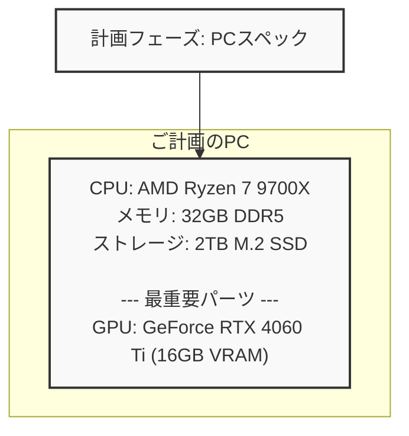
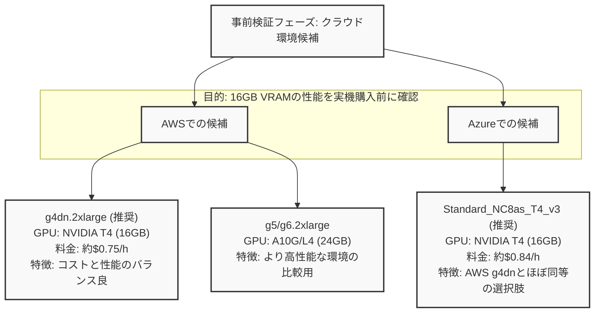
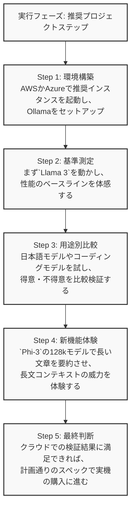

ああああああ






```mermaid
graph TD
    A["検証コンテンツ: おすすめLLMモデル"] --> B[鉄板 (総合性能)];
    A --> C[日本語特化];
    A --> D[コーディング特化];
    A --> E[大注目 (新体験)];
    A --> F[限界挑戦];

    B --> B1["Llama 3 8B\n世界標準の性能"];
    B --> B2["Qwen 2 7B\n多言語・コーディングに強み"];

    C --> C1["Japanese StableLM Gamma\n高性能な日本語モデル"];
    C --> C2["Rinna / Youri\n自然な日本語会話"];

    D --> D1["DeepSeek Coder V2 Lite\n最強クラスのコード生成"];

    E --> E1["Phi-3 Mini (3.8B)\n小さいのに超賢い！"];
    E --> E2["Phi-3 Mini 128k\n革命的な長文対応"];

    F --> F1["Mixtral 8x7B\n16GB VRAMの限界性能を探る"];

    classDef default fill:#f9f9f9,stroke:#333,stroke-width:2px;
    class A,B,C,D,E,F fill:#e8f0fe,stroke:#1a73e8,stroke-width:2px;
```


